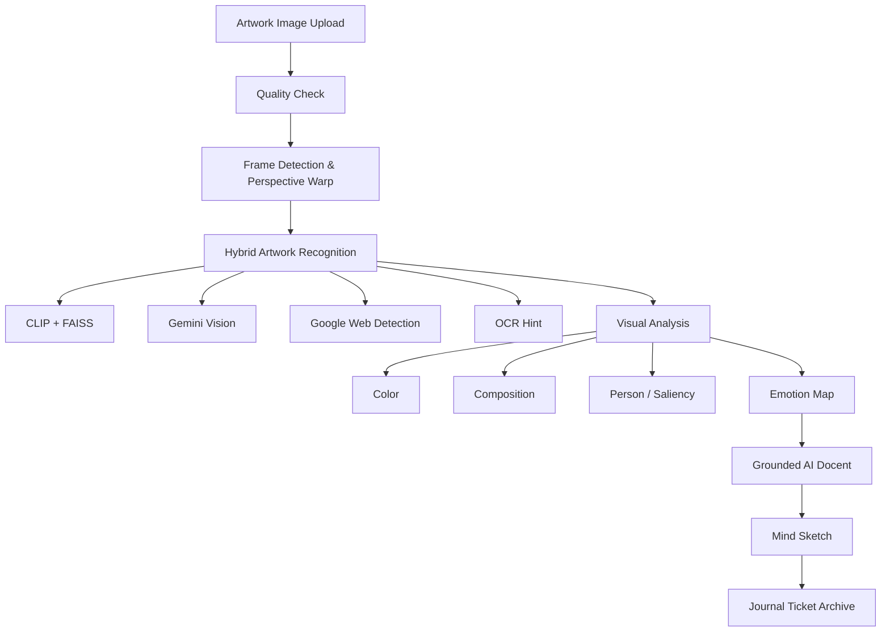

<br />


<div align="center">

# Inner Gallery

### 작품을 통해 오늘의 마음을 기록하는 AI 아트 저널

**Computer Vision · Multimodal AI · Grounded AI Docent · Art Reflection Journal**

<br />

[](https://python.org)
[](https://fastapi.tiangolo.com)
[](https://react.dev)
[](https://vitejs.dev)
[](https://opencv.org)
[](https://faiss.ai)
[](https://ai.google.dev)
[](LICENSE)

<br />

**명화를 인식하고 설명하는 것을 넘어, 작품의 색·구도·여백을 사용자의 감정 회고와 연결하는 AI 기반 아트 저널 서비스**

</div>

---

## Table of Contents

- [Overview](#overview)
- [Why I Built This](#why-i-built-this)
- [What I Built](#what-i-built)
- [Experience Flow](#experience-flow)
- [Core Features](#core-features)
- [Safety & Grounding](#safety--grounding)
- [Tech Stack](#tech-stack)
- [Getting Started](#getting-started)
- [Project Structure](#project-structure)
- [API Overview](#api-overview)
- [Future Improvements](#future-improvements)
- [License](#license)

---

## Overview

**Inner Gallery**는 명화를 단순히 인식하고 해설하는 AI 앱이 아니라, 작품을 매개로 사용자가 오늘의 마음을 돌아보고 기록할 수 있도록 설계한 **아트테라피 영감 기반 AI 아트 저널**입니다.

사용자가 작품 이미지를 촬영하거나 업로드하면 시스템은 먼저 작품 프레임을 감지하고 원근을 보정합니다. 이후 CLIP+FAISS, Gemini Vision, Google Web Detection, OCR 힌트 기반 식별을 조합해 작품 후보를 검증하고, 색채·구도·여백·인물 요소를 컴퓨터 비전으로 분석합니다.

그 결과를 바탕으로 사용자의 현재 감정과 연결된 **맞춤형 감상 해설**, **마음색**, **스케치 회고**, **전시 티켓 형태의 감상 기록**을 생성합니다.

> Inner Gallery는 작품을 설명하는 AI가 아니라,  
> **작품을 통해 나를 돌아보게 하는 AI**입니다.

본 프로젝트는 의료적 치료나 심리 진단을 제공하지 않습니다. 다만 아트테라피의 감상 방식에서 영감을 받아, 작품의 시각 요소를 통해 감정을 언어화하고 개인적인 기록으로 남기는 경험을 제공합니다.

---

## Why I Built This

미술 감상은 흔히 작품명, 작가, 사조, 역사적 배경을 이해하는 **지식 중심 경험**으로 소비됩니다. 하지만 실제로 그림 앞에 오래 머무르게 되는 순간은 반드시 정보에서만 오지 않습니다.

어떤 작품은 색 하나로 마음을 누그러뜨리고, 어떤 구도는 말로 설명하기 어려운 고요함을 만들며, 어떤 여백은 오늘의 감정을 다시 바라보게 합니다.

**Inner Gallery**는 이 감상 경험을 기술적으로 구현해보고자 시작한 프로젝트입니다. 단순히 명화를 맞히고 설명하는 데 그치지 않고, 작품의 색채와 구도, 여백, 시선 흐름이 사람의 정서에 어떻게 닿을 수 있는지를 컴퓨터 비전으로 분석하고, 이를 사용자의 현재 감정과 연결해 개인적인 회고 경험으로 확장하는 것을 목표로 했습니다.

이 과정에서 가장 중요하게 본 것은 두 가지입니다.

1. **감상문이 근거 없는 감성문으로 흐르지 않도록 만들 것**  
   실제 시각 분석 결과와 검증된 작품 정보를 기반으로 AI 해설을 생성하도록 설계했습니다.

2. **감상 이후의 마음 변화가 사라지지 않도록 기록화할 것**  
   작품 정보, 감정, 질문, 스케치, 회고를 하나의 전시 티켓처럼 저장해 개인적인 아카이브로 남길 수 있게 했습니다.

즉, Inner Gallery는 작품을 평가하거나 단순히 설명하는 앱이 아니라, **작품을 매개로 자신의 감정을 언어화하고 기록하는 AI 기반 아트 저널**입니다.

---

## What I Built

이 프로젝트는 외부 API 호출만으로 구성된 단순 데모가 아니라, **명화 감상이라는 도메인에 맞춘 데이터 자산, 컴퓨터 비전 파이프라인, LLM 안전장치, 저널 UX**를 직접 설계한 풀스택 AI 서비스입니다.

### 직접 구축한 데이터 자산

| Asset | Description |
|---|---|
| `artwork_era_db.json` | 6,905줄 규모의 명화 맥락 지식 DB. 작품별 사조, 제작 배경, 시대 맥락, 작가 생애, 시각적 연결 정보를 직접 큐레이션 |
| `index.faiss` | 18,455개 명화 이미지를 CLIP ViT-B/32로 임베딩한 로컬 벡터 검색 인덱스 |
| `metadata.json` | FAISS 검색 결과와 연결되는 작품명, 작가, 장르, 연도 등 메타데이터 |
| `solace.db` | 사용자, 작품, 감상 기록, 스케치, 감정 태그를 저장하는 SQLite 데이터베이스 |
| `backend/scripts/` | 데이터셋 전처리, FAISS 인덱스 빌드, 작가 정보 임포트, DB 검증 및 마이그레이션 스크립트 |

### 직접 설계한 CV/AI 파이프라인

- Roboflow 기반 작품 프레임 감지 및 8% padding crop
- OpenCV 기반 Perspective Warp로 비스듬한 작품 사진 정면 보정
- Laplacian variance, brightness, glare ratio, artwork size 기반 화질 사전 검사
- CLIP ViT-B/32 + FAISS 기반 로컬 벡터 검색
- Gemini Vision, Google Web Detection, OCR 힌트를 조합한 4-Way 작품 식별
- KMeans 기반 주조색 추출 및 명화 도메인 특화 색채 분석
- 구도, 여백, 대칭성, 주목도(Saliency Map) 분석
- HOG, Haar Cascade, 피부색 fallback을 조합한 미술 작품 인물 감지
- `safe_visual_facts` / `blocked_uncertain_facts` 분리로 LLM 환각 방지
- 생성 후 unsupported visual claim 검증 및 재생성 파이프라인

### 기획·UX 설계 포인트

- 작품 해설을 “정답 제공”이 아니라 “자기 회고”로 이어지게 하는 3단계 감상 구조 설계
- 감상 후 스케치를 남기고 AI 회고문으로 다시 해석하는 Mind Sketch UX 구현
- 감상 기록을 전시 티켓 형태로 저장해 개인 아카이브처럼 보관하는 Journal UX 설계
- 의료적 치료·진단처럼 보이지 않도록 표현 범위와 안전 문구를 명확히 제한

---

## Experience Flow

```text
이미지 업로드 / 카메라 촬영
        ↓
화질 검사 → 작품 프레임 감지 → 크롭 → 원근 보정
        ↓
CLIP+FAISS · Gemini Vision · Google Web Detection · OCR 힌트
        ↓
4-Way 하이브리드 작품 식별
        ↓
색채 · 구도 · 인물 · Saliency 분석
        ↓
감정 지도 생성 + 사용자 감정 상태 반영
        ↓
AI 도슨트 해설 생성
        ↓
마음 스케치 → AI 회고
        ↓
전시 티켓 형태로 저장 → Inner Gallery 아카이브
```



---

## Core Features

### 1. Artwork Recognition — 4-Way Hybrid Validation

단일 모델에 의존하지 않고 네 가지 인식 경로를 교차 검증합니다.

| Engine | Role |
|---|---|
| **CLIP + FAISS** | 18,455개 명화 이미지 로컬 벡터 인덱스 기반 유사도 검색 |
| **Gemini Vision** | 작품명, 작가, 제작 연도, 이미지 내 시각 정보 추론 |
| **Google Cloud Vision Web Detection** | 미술관·위키피디아 등 신뢰 도메인 기반 웹 교차 검증 |
| **OCR Hint Injection** | 전시장 작품 라벨의 제목·작가 정보를 추출해 인식 힌트로 사용 |

식별 결과는 다음 상태로 분류합니다.

| Status | Meaning |
|---|---|
| `confirmed` | 내부 인덱스와 외부 검증 결과가 모두 높은 신뢰도로 일치 |
| `internal_match` | 로컬 FAISS 기반 유사도는 높지만 외부 검증은 제한적 |
| `web_confirmed` | 웹 검증 결과가 강하게 일치 |
| `unknown` | 작품명을 단정하지 않고 색채·구도 중심 감상으로 전환 |

불확실한 작품은 억지로 추정하지 않고, **식별 가능한 시각 요소 중심의 감상 경험**으로 자연스럽게 전환합니다.

---

### 2. Computer Vision Pipeline

LLM에 이미지를 바로 넘기지 않고, 먼저 컴퓨터 비전 파이프라인을 통해 해설의 근거가 되는 시각 정보를 추출합니다.

#### Input Quality Check

| Check | Algorithm | Threshold |
|---|---|---|
| Blur | Laplacian variance | `< 75.0` |
| Darkness | Average brightness | `< 0.12` |
| Glare | Bright pixel ratio + largest blob | `> 8%` or blob `> 1.5%` |
| Artwork size | bbox / image area | `< 15%` |

#### Frame Detection & Perspective Warp

```python
# Dynamic Canny threshold
v = np.median(blur)
edges = cv2.Canny(blur, lower=0.67 * v, upper=1.33 * v)

# Convex quadrilateral detection → Homography
M = cv2.getPerspectiveTransform(src_corners, dst_corners)
warped = cv2.warpPerspective(img, M, (target_w, target_h))
```

사각형 윤곽 검출에 실패하면 8% padding crop으로 fallback합니다. 또한 원본과 crop 이미지를 함께 분석하는 dual-image 전략을 사용해 작품 인식 안정성을 높였습니다.

#### Color, Composition, Saliency

| Area | Implementation |
|---|---|
| **Color** | KMeans(k=5)로 주조색 5가지 추출, RGB/HSV/점유율 계산 |
| **Custom Color Rules** | 무채색 필터, Gold/Amber 별도 분류, 밝은 영역 위치 추적 |
| **Composition** | 9분할 위치, 여백 비율, 대칭성, 피사체 규모, edge direction 분석 |
| **Saliency** | OpenCV StaticSaliencySpectralResidual + 대비 기반 fallback |

---

### 3. Emotion Map

색채·구도·인물 분석값을 조합해 6가지 감정 차원을 계산합니다.

| Emotion | Main Signals |
|---|---|
| 안정감 | 저채도, 높은 대칭성, 적절한 여백 |
| 고독감 | 어두운 톤, 차가운 색, 넓은 여백, 작은 피사체 |
| 긴장감 | 높은 명암 대비, 고채도, 비대칭 구도 |
| 따뜻함 | 따뜻한 색 비율, 높은 밝기 |
| 슬픔 | 어두움, 저채도, 차가운 색, 위축된 자세 |
| 생동감 | 밝음, 고채도, 따뜻한 색, 활기 있는 자세 |

감정 판단은 단순 임계값이 아니라 복합 조건으로 보정했습니다. 예를 들어 밝고 차가운 색은 고독감이 아니라 평온함으로 해석하고, 밝고 열린 여백은 고독이 아닌 해방감으로 반영합니다.

---

### 4. Grounded AI Docent

AI 도슨트는 다음 데이터를 기반으로 해설을 생성합니다.

- `safe_visual_facts`: 신뢰도 높은 시각 분석 결과
- `blocked_uncertain_facts`: 추측이 금지된 불확실한 항목
- 직접 구축한 작품 맥락 DB
- 감정 지도 및 사용자 감정 상태
- 사용자가 선택한 해설 스타일

해설은 항상 다음 3단계 구조를 따릅니다.

```text
1. 시각 분석    색채·구도·여백·인물 요소 묘사
2. 정서적 작용  시각 요소가 감상자에게 줄 수 있는 감각 설명
3. 자기 회고   작품을 통해 자신의 마음을 돌아보는 질문 제안
```

지원하는 해설 스타일은 `아트 테라피`, `도슨트 해설`, `시각 분석`, `짧은 감상`입니다.

---

### 5. Mind Sketch & Art Journal

감상 후 HTML5 Canvas에 마음의 흔적을 남길 수 있습니다.

| Mode | Description |
|---|---|
| 자유 그리기 | 마음에 남은 형태를 자유롭게 그림 |
| 색으로 채우기 | 감정에 가까운 색으로 캔버스를 채움 |
| 선으로 남기기 | 감정의 방향을 선으로 표현 |
| 한 문장 쓰기 | 작품이 건넨 말을 짧게 기록 |

완성된 스케치는 Gemini가 선·색·여백을 읽어 짧은 회고문을 생성합니다. 모든 감상은 작품 정보, 해설, 질문, 감정 변화, 마음색, 스케치, 개인 메모와 함께 **전시 티켓(No. IG-XXXX)** 형태로 저장됩니다.

---

## Safety & Grounding

Inner Gallery는 LLM의 감성적 글쓰기가 근거 없는 해설로 흐르지 않도록 다음 장치를 둡니다.

- 불확실한 표정·시선·자세는 `blocked_uncertain_facts`로 분리
- 추상화·풍경·정물·건축 작품에서는 인물 분석 자동 비활성화
- 의료적 치료, 심리 진단, 정서 개선 효과 표현 금지
- 감상자의 현재 감정을 단정하지 않고 가능성형으로 표현
- 작품 식별 신뢰도가 낮을 경우 작품명 단정을 피하고 시각 분석 중심 감상으로 전환
- 생성 후 근거 없는 시각 주장 검증 및 필요 시 재생성

---

## Tech Stack

| Area | Stack |
|---|---|
| **Frontend** | React 18, Vite, React Router, HTML5 Canvas, Vanilla CSS, Axios |
| **Backend** | Python 3.11, FastAPI, SQLite, Uvicorn, JWT Auth, passlib |
| **Computer Vision** | OpenCV, Roboflow Serverless, KMeans, HOG, Haar Cascade, Saliency Map, Perspective Transform |
| **AI / ML** | Gemini 2.0 Flash, Google Cloud Vision API, CLIP ViT-B/32, FAISS IndexFlatIP, scikit-learn, NumPy |
| **Data** | `artwork_era_db.json`, `index.faiss`, `metadata.json`, `solace.db` |

---

## Getting Started

### Requirements

- Python 3.11+
- Node.js 18+
- Gemini API Key
- Optional: Google Cloud Vision API Key, Roboflow API Key

### Environment Variables

```env
GEMINI_API_KEY=your-key

# Optional
GOOGLE_CLOUD_VISION_KEY=your-key
ROBOFLOW_API_KEY=your-key
SECRET_KEY=your-jwt-secret
```

### Backend

```bash
python -m venv venv
source venv/bin/activate        # Windows: venv\Scripts\activate

pip install -r requirements.txt
uvicorn backend.main:app --reload --port 8000
```

### Frontend

```bash
cd frontend
npm install
npm run dev
# http://localhost:5173
```

### Optional: Build FAISS Index

```bash
# Place Kaggle artwork datasets under backend/artwork_sources/
python backend/scripts/build_index.py
```

---

## Project Structure

```text
inner-gallery/
├── backend/
│   ├── main.py                 # API endpoints and analysis pipeline
│   ├── auth.py                 # JWT authentication
│   ├── database.py             # SQLite CRUD
│   ├── artwork_index/          # FAISS index and metadata
│   ├── data/                   # artwork_era_db.json, web cache
│   └── scripts/                # dataset and DB pipeline scripts
│
├── modules/
│   ├── color_analyzer.py       # custom artwork color analysis
│   ├── composition_analyzer.py # composition, negative space, symmetry
│   ├── person_analyzer.py      # HOG + fallback person analysis
│   ├── emotion_scorer.py       # 6D emotion map
│   ├── llm_generator.py        # docent essays and chat
│   ├── artwork_matcher.py      # CLIP + FAISS matching
│   ├── era_lookup.py           # curated artwork DB lookup
│   └── quality_checker.py      # image quality pre-check
│
└── frontend/src/
    ├── pages/                  # Home, Upload, Results, Drawing, Journal
    ├── components/             # UI components
    ├── context/                # App and auth state
    └── utils/                  # matching and detection helpers
```

---

## API Overview

| Method | Endpoint | Description |
|---|---|---|
| `POST` | `/api/analyze` | 이미지 전체 분석 파이프라인 실행 |
| `POST` | `/api/quick-match` | 업로드 즉시 Top-5 작품 후보 미리보기 |
| `POST` | `/api/quick-quality` | 이미지 화질 사전 검사 |
| `POST` | `/api/sketch-reflection` | 마음 스케치 회고문 생성 |
| `POST` | `/api/essay-text` | 텍스트 기반 에세이 재생성 |
| `POST` | `/api/artwork-era` | 작품 사조·시대·작가 맥락 조회 |
| `POST` | `/api/docent-chat` | 작품 기반 도슨트 채팅 |
| `GET` | `/api/daily-artwork` | 오늘의 명화 추천 |
| `GET/POST/PATCH/DELETE` | `/api/journal` | 감상 기록 CRUD |
| `POST` | `/auth/register`, `/auth/login` | 회원가입 및 로그인 |

---

## Future Improvements

- 실제 갤러리 촬영 데이터 기반 frame detection fine-tuning
- OCR 기반 작품 라벨 인식 고도화
- 감정 지도 시각화 개선
- 저널 검색·필터링 기능
- 사용자별 감상 패턴 리포트
- 다국어 도슨트 해설
- 작품 인식 실패 케이스를 활용한 active learning 데이터셋 구축

---

## License

[MIT](LICENSE)
